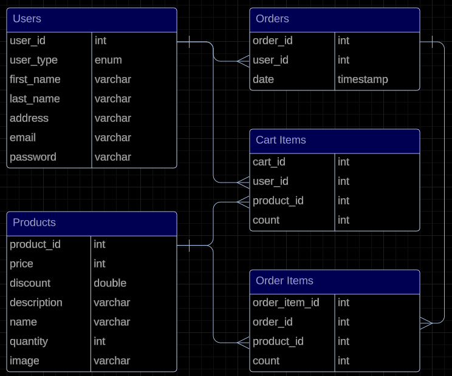

# EeE-Commerce_back
Team 3 (tentative name) Ee E-Commerce

E-Commerce app where we only sell things shaped like the letter ‘E’ or ‘e’

Background of Project

- This project is an e-commerce application where sellers will be able to sell items shaped like an ‘e’ in either upper or lower case. Buyers will be able to find and buy unique one-of-a-kind items.

User Stories

Required

- Register
  - As a User, I should be able to add a new account.
- Login
  - As a User, I should be able to log in to an account.
- View Profile
  - As a User, I should be able to create and Maintain a Profile page.
- View Products
  - As a User, I should be able to View all of Products.
- Cart
  - As a User, I should be able to add items to cart and purchase or remove.
- Checkout
  - As a User, I should be able to purchase all items and remove them from the inventory.

Optional

- Select Quantity of Product to add to cart
  - As a User, I should be able to select any amount of any item to add to cart.
- Search for products
  - As a User, I should be able to search the product list to find items I am interested in.
- Search for sales and buy at sale price
  - As a User, I should be able to see and purchase items that are on sale for a lower price.
- Featured Products
  - As a User, I should be able to see a list of featured products on the main page of the application.
- Reset Password/Update user info
  - As a User, I should be able to reset my password.
- Dark mode
  - As a User, I should be able to change the color scheme from normal mode to dark mode option.
- Tech support live chat
  - As a User, I should be able to enter a live chat with technical support to ask questions.
  - As a User, I should be able to accept a live chat request and answer any questions a user might have.
- Notifications on transaction
  - As a User, I should be able to receive notifications when a transaction has occurred, or a transfer has been completed.

Challenges

- Backend Testing (70%)
  - Perform Unit & Integration Testing with the backend.
- Spring Security Implementation with JWT
  - Learn to Utilize Spring Security & implement with JWT
- Integrate a 3rd Party API
  - (MUST be approved by Trainer first) Find a free API to integrate with your project, establishing a User Story appropriate to your application.

## Contributors:
- Amsal Kassam
- Arjun Ramsinghani
- Connie Angeley
- Ruben Fitch
- Miguel Helguero

